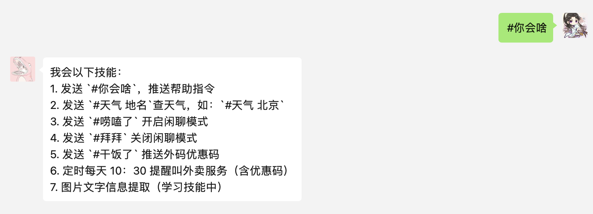
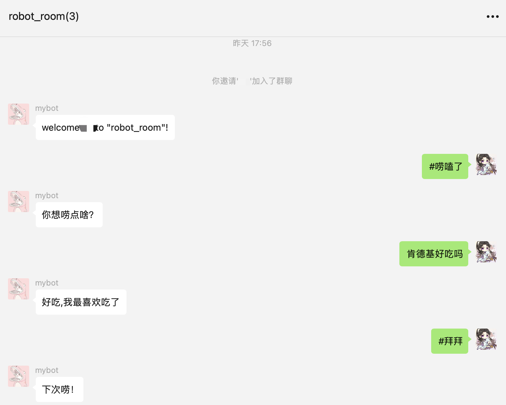
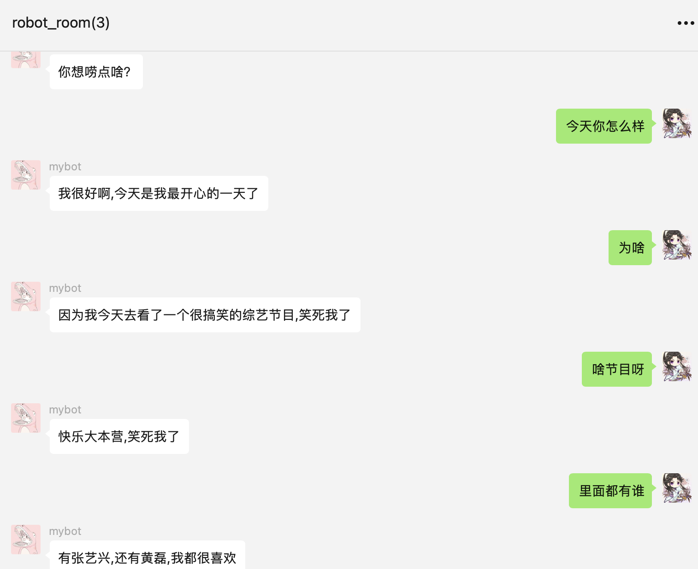
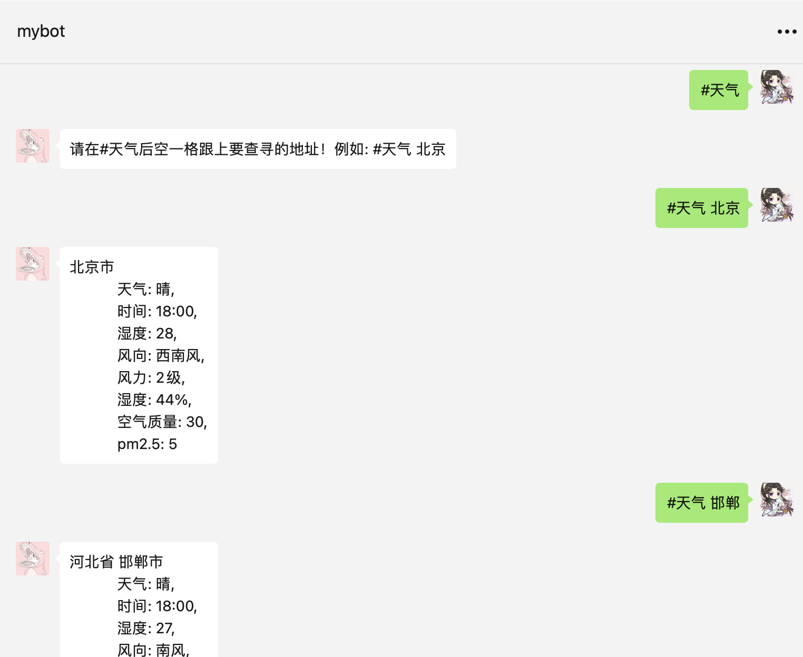
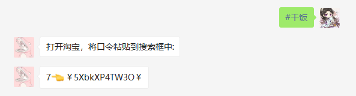

# HowlerBot   [](https://wechaty.js.org/docs/contributing/)
HowlerBot 定位是生活帮手，陪玩，整蛊等多元化的机器人。由于目前智商感人，有时候让人抓狂！不过她会成长，所以请给她点耐心，让我们见证脑残儿童的成长吧！
## Prerequisites
1. 需要获取 `Wechaty Puppet Service` 的 `token` 
   1. [有关 token 的说明](https://wechaty.js.org/docs/puppet-services/#get-a-token)
   2. [申请免费试用地址](http://pad-local.com/#/tokens)
2. `python-wechaty` 是 `wechaty` 的 python 客户端
   1. github 地址: https://github.com/wechaty/python-wechaty
3. `paddlepaddle`, `paddlenlp` (用于一些本地模型推理，后期会分离出去，采用远端调用的方式请求，本地弊端太多)
   1. paddlepaddle github: https://github.com/PaddlePaddle/Paddle
   2. paddlenlp github: https://github.com/PaddlePaddle/paddlenlp


## Usage
### 如何启动
   1. 需要修改 `main.py` 中环境变量 `WECHATY_PUPPET_SERVICE_TOKEN` 对应你的 puppet service gateway 的 token. [相关内容见 python-wechaty 文档](https://python-wechaty.readthedocs.io/zh_CN/latest/introduction/use-padlocal-protocol/)
   
   2. 安装依赖
      ```python
      pip install -r requirements
      ```
   3. 执行启动命令
      ```bash
      python main.py
      ```

### 目前机器人支持以下场景和指令
1. `#你会啥`
   微信内推送帮助指令

2. `#唠嗑了`
   开启闲聊模式，可以和你侃天侃地，你说一句，她回一句，不过不是简单一问一答的句式，而是她会在对话的过程中，主动询问，从而是整个聊天过程更加生动。从进入闲聊模式后，就记录了此次聊天的全部上下文在内存中（未来可以考虑引入缓存的管理算法，避免单次聊天内容过长，导致内存溢出），因此，在单轮闲聊模式中不会出现内容断层的现象。此外，她具备一些基础 knowledge，不会显得过于傻。通过 `#拜拜` 指令进行关闭闲聊模式，此时会释放此次对话的上下文内容。 

3. `#拜拜`
   关闭闲聊模式。（释放对话上下文信息）

4. `#天气 xxx`
   查询天气预报，例如 `#天气 北京`。目前支持国内。

5. `#干饭`
   会发出`饿了吗`外卖优惠券。除了使用该指令触发，还会定时每天 10 点半，主动提醒，让你错峰订餐，避免高峰等待过长时间用膳。

6. 进群欢迎语
   当有新朋友进入机器人所在的群的时候，机器人会主动发送欢迎的消息。

## Demo
一些具体的例子
* 帮助指令
  

* 进群欢迎语  
  

* 闲聊  
  

* 查询天气  
  

* 获取外卖优惠码  
  


## Citation
```
@misc{wechaty,
  author = {Huan LI, Rui LI},
  title = {Wechaty: Conversational RPA SDK for Chatbot Makers},
  year = {2016},
  publisher = {GitHub},
  journal = {GitHub Repository},
  howpublished = {\url{https://github.com/wechaty/wechaty}},
}
```
